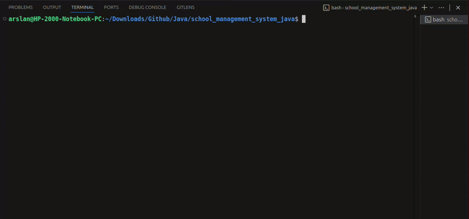
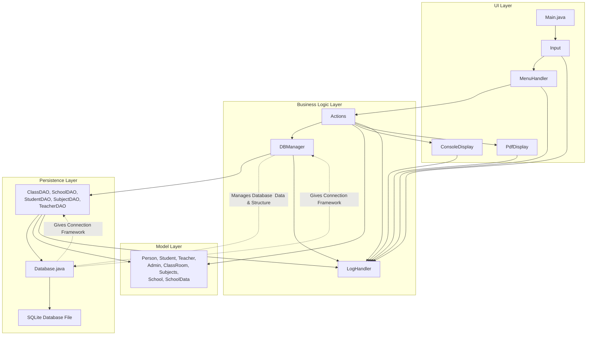

# School Management System


## Table of Contents

- [Introduction](#introduction)
- [Features](#features)
- [Project Structure](#project-structure)
- [Installation & Setup](#installation--setup)
  - [Requirements](#requirements)
  - [Tools Used](#tools-used)
  - [Guide (Step-by-Step)](#guide-step-by-step)
- [Program Flow](#program-flow---how-program-runs-or-organised)
  - [Basic Flow](#basic-flow-user)
  - [General Classes Calling Flow](#general-call-flow)
  - [Responsibilities](#responsibilities)
  - [General Description](#general-descriptions)
  - [Program  Structure Visual](#structure-visually)
- [Acknowledgements & Notes](#acknowledgements--notes)

## Introduction

A console-based application to manage basic school operations like adding, removing, updating, showing students, teachers, classes and subjects.

<details>
<summary>Basic Preview</summary>



</details>

---

## Features

- Add, update, and view classes (with fees)
  - Fee Reciept for Student
- Associate subjects with classes, manage subject details
- Assign teachers to subjects
- Maintain student records, and academic details (including student reports)
- **SQLite-based backend** for persistent storage
- Show/export data in the console or as PDF reports
- Detailed logging of system activities using Java's Logger

---

## Project Structure

```structure
school_management_system_java/
├── Main.java
├── build.sh - script to run
├── lib/
│   ├── itext-2.1.7.jar
│   └── sqlite-jdbc-3.50.3.0.jar
├── display/
│   ├── Input.java
│   ├── Display.java
│   ├── ...
│   └── MenuHandler.java
│   └── LogHandler.java
├── people/
│   ├── Person.java
│   ├── Admin.java
│   ├── Student.java
│   └── Teacher.java
├── classroom/
│   ├── ClassRoom.java
│   └── Subjects.java
├── database/
│   ├── Database.java
│   ├── DBmaker.java
│   ├── DBManager.java
│   ├── DATABASE.md  (now README.md)
│   ├── ... db files
│   └── DAO/
│       ├── ClassDAO.java
│       ├── SubjectDAO.java
│       ├── StudentDAO.java
│       ├── TeacherDAO.java
│       ├── SchoolDAO.java
│       ├── editDB.java
│       └── testing.java
└── ...
```

---

## Installation & Setup

### Requirements

- Java JDK (17 or later)
- SQLite JDBC & iText driver (already included in `lib/`)
- Git

### Tools Used (& Learnings)

- **Language:** Java
- Java JDK
- **Database:** **SQL**ite
- **IDE:** VS Code (Java)
- **Libraries:**
  - java.util.logging for logging
  - SQLite JDBC driver for database connectivity
  - PDF generation library (iText)

> [!Note]
> Learn about [SQLite & Database](database/README.md) here.

### Guide (Step-by-Step)

1. Clone the repo:

   ```sh
   git clone https://github.com/ch-arslanahmad/school_management_system_java.git
   cd school_management_system_java
   ```

2. Compile and run:
There are two options:

- Direct Command

Run the following:

```shell
javac -d bin -cp "storage/lib/sqlite-jdbc-3.50.3.0.jar:storage/lib/itext-2.1.7.jar"
```

- Run `build.sh` script (simple, & for macOS / Linux users)

```shell
chmod +x buil.sh
./build.sh Main
```

If it does not work, make sure you are in correct directory and run again with:

```shell
sudo chmod +x buil.sh
./build.sh Main
```

You will need to provide device password.

> [!Note]
> This is a CLI-based app.
---

## Program Flow - how program runs or organised?

This will walkthrough the main program flow for effective understanding or tweaks.

### Basic Flow (User)

- Launch `Main.java` to start the system.
- Use the menu options to navigate:
  - CRUD Operations of Classes, Subjects, Teachers & Students
    - View / Export Reports (console or PDF)
  - Manage school info (view/update)
- All actions are available in a loop until you choose to exit (via '0').

---

### General call flow

```diagram

Main.java -> LogHandler(Open) -> MenuHandler -> Actions -> DAOs -> Database
                                  |              |           |
                                  |              |           |
                                  v              v           v
                               Model Classes <---+---------> Display
-> LogHandler(Close)

```

**Result:**

- Database Update
- Display shown in PDF/Console

### Responsibilities

- `Main.java` — program entry point. Creates the main helpers (menu, input, DB manager) and runs the menu loop.

- `display/MenuHandler.java` — shows menus, reads/validates input, and dispatches to handlers.

- `school/Actions.java` — business-level operations that glue menus to DAOs and display code.

- `display/ConsoleDisplay.java` / `display/PdfDisplay.java` — presentation logic (console formatting and PDF export).

- `database/Database.java`, `DBManager.java` — connection, initialization, and transaction helpers.

- `database/DAO/*.java` — data access objects (CRUD) for classes, students, teachers, subjects, and school info.

- `people/`, `classroom/`, `school/` — model classes (Student, Teacher, ClassRoom, Subjects, School, etc.), that are essential for every operation relating to display or Database as they are the `model`.

- `display/LogHandler.java` — logger setup; logs are written to files under `log/`.

- `storage` folder holds logs, an image, JAR files and Database file.

### General Descriptions

- **Menus and User flow**: `display/MenuHandler.java` and `Main.java`.
- **Input** *handled* by `display/Input.java`

- **Action/Process logic**: `school/Actions.java` and the ***DAOs*** (Data Access Object) in `database/DAO/*`.

- Actual **Database** *actions/queries* Logic: `database/DAO/*`
- **Database** (*Connection* & Creation): `database/Database.java` and `database/DBManager.java`.

- **Logging** (Creation & Writing): `display/LogHandler.java`

- **Display (CLI):** Everything display relating is in `display/*`
  - PDF or Console: `display/ConsoleDisplay.java` for console output and `PdfDisplay.java` for PDF output.

### Structure (Visually)



---

## Acknowledgements & Notes

This project was designed with the intention to follow the principles of:

- Separation of Concerns
- Single Responsibility Principle

It also uses:

- SQLite for lightweight database management
- Java Logger framework for robust logging
- PDF libraries (iText) for export functionality

> [!NOTE]
> While these principles guided the structure of the project, some areas may not fully adhere to them, as this is a learning and practical implementation project.
